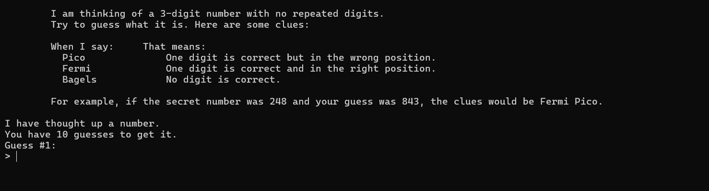
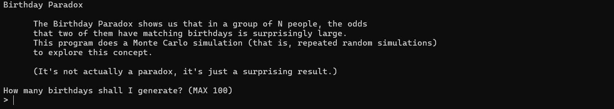

# Python Projects

My mission is to master Python's practical applications—scripting, networking, virtualization, and cloud computing—while refining technical concepts into clear, accessible explanations and improving problem-solving skills.

## Python Project Startup

### Dependencies

The following packages are required for some of the programs:

- **pyperclip** – Clipboard access for text handling
- **bext** – Terminal-based UI enhancements
- **playsound** – Audio playback support
- **pyttsx3** – Text-to-speech conversion

### Python Version

The following programs were developed using Python version:

```python
Python 3.13.2
```

## Programs

### #1 Bagels

In Bagels, a deductive logic game, you must guess a secret three-digit number based on clues. The game offers one of the following hints in response to your guess:

"Pico" when your guess has a correct digit in the *wrong* place, "Fermi" when your guess has a correct digit in the *correct* place, and "Bagels" if your guess has no correct digits. You have 10 tries to guess the secret number.

#### Preview



### #2 Birthday Paradox

This Python program simulates the Birthday Paradox using a Monte Carlo approach. It randomly generates a set number of birthdays, checks for duplicates, and runs 100,000 simulations to estimate the probability of at least two people sharing a birthday in a group. The results highlight the surprisingly high likelihood of birthday matches in even relatively small groups.

#### Preview

